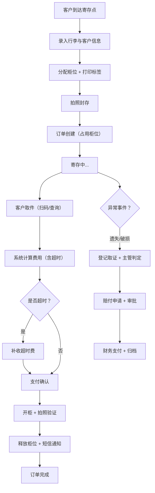

## 1. 产品概述

行李寄存运营管理系统，面向大型商圈、展会和景区，提供统一的临时寄存服务管理平台。解决传统人工登记效率低、柜位混乱、纠纷难追溯、财务不透明等痛点，实现寄存业务全流程数字化管理。

- **目标用户**：商圈运营方、展会主办方、景区管理处及其现场工作人员、财务人员、系统管理员
- **核心价值**：提升寄存服务效率、减少人工作业差错、规范财务结算、增强客户体验与安全保障

## 2. 核心功能

### 2.1 用户角色

| 角色 | 说明 | 核心权限 |
|------|------|----------|
| 系统管理员 | 总部/平台管理人员 | 创建寄存区、全局配置、用户管理、权限分配、数据总览 |
| 门店主管 | 寄存区负责人 | 柜位管理、异常处理、人员排班、退款审批、门店报表 |
| 现场操作员 | 一线服务人员 | 收件入库、订单核销、取件出库、标签打印、拍照封存 |
| 财务人员 | 财务结算人员 | 日结报表、门店分账、优惠抵扣、保价赔付、对账导出 |

### 2.2 功能模块

1. **运营总览**：实时数据大盘、多门店对比、寄存趋势、容量预警、异常概览
2. **寄存区配置**：寄存区增删改查、开放时间、收费规则、容量上限、超时策略、禁寄物品提示
3. **柜位管理**：柜位分区/编号/状态可视化、批量导入、柜位维护、占用释放
4. **现场收件**：行李类型录入、客户信息、团体寄存、批量入库、标签打印、柜位绑定、拍照封存
5. **订单核销**：扫码取件、超时计费、补收费用、短信提醒、找包搜索、订单状态流转
6. **异常事件**：遗失登记、破损拍照、客户投诉、赔付申请、事件跟踪与归档
7. **人员排班**：班次设置、人员分配、交接班清点、考勤记录、库存盘点
8. **财务结算**：日结报表、门店分账、优惠抵扣记录、保价赔付、收支明细、对账导出

### 2.3 页面详情

| 页面名称 | 模块名称 | 功能描述 |
|----------|----------|----------|
| 运营总览 | KPI 概览卡片 | 今日寄存单数、在存件数、营收、柜位使用率、超时单数、异常单数 |
| 运营总览 | 实时容量热力图 | 各寄存区柜位使用率颜色编码，超阈值高亮预警 |
| 运营总览 | 趋势图表 | 近7日寄存量/营收折线图、寄存类型饼图、取件时效柱状图 |
| 运营总览 | 异常提醒面板 | 待处理异常、超时未取、容量预警快捷入口 |
| 寄存区配置 | 寄存区列表 | 多门店/寄存区卡片列表，状态标签（营业/打烊/维护） |
| 寄存区配置 | 收费规则配置 | 按时/按次/阶梯收费、首小时定价、超时单价、封顶金额 |
| 寄存区配置 | 时段与容量 | 开放时间设置、节假日例外、柜位总数、大中小格占比 |
| 寄存区配置 | 禁寄与提示 | 禁寄物品清单、温馨提示文案、保价费率配置 |
| 柜位管理 | 可视化平面图 | 柜位网格布局、状态颜色（空闲/占用/预留/故障/清洁） |
| 柜位管理 | 柜位筛选 | 按尺寸（大/中/小）、状态、楼层分区筛选 |
| 柜位管理 | 柜位操作 | 批量启用/停用、标记故障/维修完成、手动释放 |
| 柜位管理 | 柜位详情 | 关联订单信息、占用时间、历史使用记录 |
| 现场收件 | 快速收件表单 | 手机号/姓名/行李类型/数量/保价金额/预计取件时间 |
| 现场收件 | 团体寄存 | 同订单多件行李、统一客户信息、批量分配柜位 |
| 现场收件 | 标签生成打印 | 二维码标签模板、批量打印、热敏纸兼容 |
| 现场收件 | 拍照封存 | 行李多角度拍照上传、图片关联订单、封存确认 |
| 订单核销 | 扫码/单号查询 | 扫码枪/手动输入单号、展示订单详情与柜位号 |
| 订单核销 | 超时计费 | 自动计算超时时长与费用、支持多收费规则、补收确认 |
| 订单核销 | 取件出库 | 拍照验证、柜位释放、短信通知取件完成 |
| 订单核销 | 找包搜索 | 多条件组合查询（手机号/单号/时间/柜位/特征描述） |
| 异常事件 | 异常列表 | 按类型筛选（遗失/破损/投诉/其他）、状态流转 |
| 异常事件 | 遗失登记 | 物品描述、最后出现位置、联系信息、查找进度跟踪 |
| 异常事件 | 破损取证 | 破损部位拍照、关联订单、责任判定、赔付金额估算 |
| 异常事件 | 赔付审批 | 主管审核赔付申请、财务复核、赔付完成归档 |
| 人员排班 | 班次日历 | 周/月视图、早/中/晚班色块、人员拖拽分配 |
| 人员排班 | 交接班清点 | 当班在存件数、异常件数、柜位状态核对、签字交接 |
| 人员排班 | 库存盘点 | 定期盘库、在存件实物核对、差异报告、异常标记 |
| 人员排班 | 考勤记录 | 打卡时间、班次实际时长、异常考勤标注 |
| 财务结算 | 日结报表 | 当日收入明细（寄存费/超时费/保价费）、退款抵扣、实收金额 |
| 财务结算 | 门店分账 | 多门店收入汇总、按比例/固定分账、对账单生成 |
| 财务结算 | 优惠与赔付 | 优惠券使用记录、折扣明细、保价赔付台账 |
| 财务结算 | 导出与对账 | 支持 Excel/PDF 导出、对账周期设置、操作审计日志 |

## 3. 核心流程

### 3.1 寄存流程
客户到达寄存点 → 现场操作员录入行李信息与客户联系方式 → 系统推荐空闲柜位（或手动选择） → 打印二维码标签并贴于行李 → 操作员拍照封存行李 → 客户获得取件凭证（小票/短信） → 柜位状态标记为占用

### 3.2 取件流程
客户出示取件码/手机号 → 操作员扫码或查询订单 → 系统自动计算费用（含超时费） → 客户支付费用 → 操作员打开对应柜位 → 拍照验证取件并释放柜位 → 发送完成通知短信

### 3.3 异常处理流程
发现异常（遗失/破损） → 现场登记并拍照取证 → 关联原始订单 → 主管介入判定责任 → 发起赔付申请 → 主管审批 → 财务复核打款 → 事件归档并生成报表

### 3.4 流程图

## 4. 用户界面设计

### 4.1 设计风格
- **主题基调**：工业级商务风格，深色导航 + 浅色内容区，强调专业感与数据清晰度
- **主色**：深海军蓝 `#0F2747`（导航栏、头部、关键按钮）
- **辅助色**：
  - 运营蓝 `#2563EB`（主操作按钮、链接）
  - 警示橙 `#F59E0B`（容量预警、待处理）
  - 成功绿 `#10B981`（空闲、完成）
  - 危险红 `#EF4444`（异常、故障、超时）
- **中性色**：使用 slate 色系，背景 `#F8FAFC`，卡片 `#FFFFFF`，边框 `#E2E8F0`
- **字体**：
  - 标题/品牌：`Space Grotesk`（现代几何无衬线，科技感）
  - 正文/数据：`Noto Sans SC`（中文阅读友好，数字等宽特性）
- **按钮风格**：圆角 8px，悬浮 2px 阴影 + 轻微上移过渡 150ms
- **图标**：lucide-react 线性图标，尺寸统一 18px
- **布局**：左侧固定导航栏（240px） + 顶部面包屑（56px） + 主内容区卡片式布局
- **动效**：页面切换淡入 200ms，数字滚动更新 400ms，卡片悬浮位移 + 阴影加深

### 4.2 页面设计概览

| 页面名称 | 模块名称 | UI 元素 |
|----------|----------|---------|
| 运营总览 | KPI 卡片 | 6 张指标卡，数值渐变数字，趋势小 sparkline，颜色边框区分指标类别 |
| 运营总览 | 容量热力图 | 网格状寄存区缩略，使用率百分比数字，颜色由绿→橙→红渐变 |
| 运营总览 | 图表区 | 2 列布局（折线图 + 饼图/柱状图），圆角卡片，标题带 lucide 图标 |
| 寄存区配置 | 列表视图 | 卡片网格，每卡显示寄存区名称、状态徽标、收费摘要、容量进度条、操作按钮组 |
| 寄存区配置 | 配置弹窗 | 右侧滑出抽屉，分 Tab 步骤：基础信息→收费规则→时段容量→高级设置 |
| 柜位管理 | 平面图 | 固定尺寸网格，单元格带柜位号 tooltip，点击选中弹出详情侧边栏 |
| 现场收件 | 收件工作台 | 3 栏布局：左表单 + 中柜位选择 + 右预览/标签，底部操作条固定 |
| 订单核销 | 查询工作台 | 大号扫码输入框（模拟扫码），下方结果展示卡 + 费用结算面板 |
| 异常事件 | 看板视图 | 列卡片按状态分组（待处理→处理中→待审批→已完成），事件卡拖拽流转 |
| 人员排班 | 日历视图 | 周视图表格，行=人员，列=日期，单元格色块表示班次，点击编辑弹窗 |
| 财务结算 | 报表页 | 顶部日期筛选 + 汇总卡，下方标签页切换（日结/分账/优惠/赔付），表格斑马纹 |

### 4.3 响应式

- **设计优先**：桌面端 1440px 为基准设计
- **平板兼容**：≥ 1024px 保持左右布局，导航栏折叠为 64px 图标模式
- **移动端**：< 1024px 顶部汉堡菜单抽屉，卡片堆叠单列，表格水平滚动
- **触控优化**：现场收件页和核销页为触摸屏优化，按钮高度 ≥ 44px，关键操作放大

### 4.4 视觉差异化

- 导航栏采用渐变深色背景（深蓝→藏青）+ 细微噪点纹理
- KPI 卡片顶部采用 3px 渐变色边条（指标对应颜色）
- 柜位状态采用发光效果：空闲微绿光、占用微蓝光、故障微红光环
- 数据大屏页面顶部添加半透明渐变遮罩 + 几何装饰线条
- 所有表格 hover 行添加浅蓝底 + 左侧 3px 蓝色指示条
