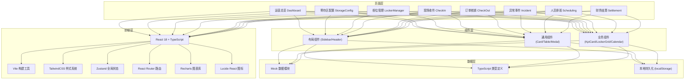
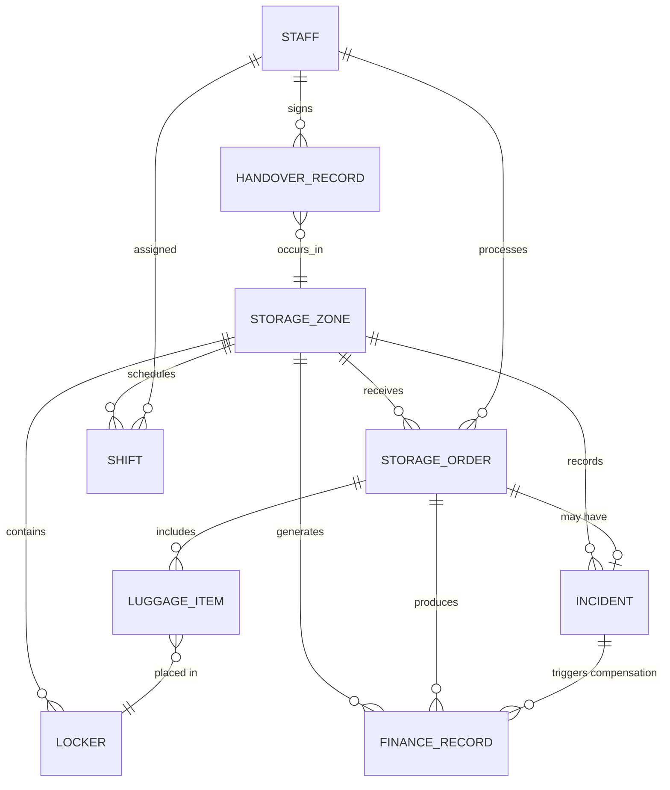

## 1. 架构设计



## 2. 技术说明

- **前端**：React@18 + TypeScript@5 + Vite@5 + TailwindCSS@3
- **初始化工具**：vite-init（内置 React Router、Zustand、Tailwind）
- **后端**：无后端，使用 Mock 数据模块 + localStorage 持久化模拟
- **图表**：Recharts@2
- **图标**：Lucide React
- **状态管理**：Zustand（集中式 store，分模块切片）
- **路由**：React Router v6（BrowserRouter）
- **日期处理**：date-fns（轻量替代 moment）
- **数据持久化**：localStorage + Zustand persist 中间件

选型理由：
- 行李寄存系统为典型后台管理系统，数据表格、表单、图表为主，React + TS + Tailwind 组合开发效率高且可维护
- 无后端依赖便于本地 Demo 演示，核心业务逻辑可直接在前端验证
- Zustand 相比 Redux 轻量零模板代码，更适合中小型管理系统
- Recharts 组件化API灵活，定制化图表能力满足运营看板需求

## 3. 路由定义

| 路由路径 | 页面组件 | 说明 |
|----------|----------|------|
| `/` | 重定向 `/dashboard` | 默认进入运营总览 |
| `/dashboard` | Dashboard | 运营总览看板 |
| `/storage-config` | StorageConfig | 寄存区配置管理 |
| `/locker-manager` | LockerManager | 柜位可视化管理 |
| `/check-in` | CheckIn | 现场收件工作台 |
| `/check-out` | CheckOut | 订单核销与取件 |
| `/incident` | Incident | 异常事件看板 |
| `/scheduling` | Scheduling | 人员排班与交接 |
| `/settlement` | Settlement | 财务结算与报表 |
| `*` | NotFound | 404 错误页 |

## 4. API 定义（前端 Mock 层）

本应用为纯前端演示，通过 Service 层封装数据操作，统一接口契约，便于后续接入真实后端。

### 4.1 类型定义（核心）

```typescript
// 寄存区
interface StorageZone {
  id: string;
  name: string;
  location: string; // 商圈/展会/景区名称
  status: 'open' | 'closed' | 'maintenance';
  openTime: string; // HH:mm
  closeTime: string; // HH:mm
  totalLockers: number;
  usedLockers: number;
  pricingRule: PricingRule;
  bannedItems: string[];
  tips: string;
  insuranceRate: number; // 保价费率 0.01 = 1%
  capacityWarning: number; // 预警阈值百分比
  createdAt: string;
}

// 收费规则
interface PricingRule {
  type: 'hourly' | 'perUse' | 'tiered';
  firstHourPrice: number;
  overtimeUnitPrice: number; // 每小时
  overtimeStepMinutes: number; // 超时计费步长
  dailyMaxPrice: number;
  smallLockerExtra: number;
  mediumLockerExtra: number;
  largeLockerExtra: number;
}

// 柜位
interface Locker {
  id: string;
  zoneId: string;
  code: string; // 柜位编号 A-01-03
  size: 'S' | 'M' | 'L';
  status: 'free' | 'occupied' | 'reserved' | 'fault' | 'cleaning';
  floor: string;
  area: string; // 分区
  currentOrderId?: string;
  occupiedAt?: string;
  remark?: string;
}

// 订单
interface StorageOrder {
  id: string;
  orderNo: string;
  zoneId: string;
  lockerIds: string[];
  customerName: string;
  customerPhone: string;
  luggageCount: number;
  luggageTypes: LuggageItem[];
  insuranceAmount: number; // 保价金额
  estimatedPickupAt?: string;
  checkedInAt: string;
  checkedInBy: string;
  photos: string[]; // 封存照片
  status: 'stored' | 'picked' | 'overtime' | 'abnormal' | 'refunded';
  baseFee: number;
  overtimeFee: number;
  insuranceFee: number;
  discount: number;
  totalFee: number;
  paidAmount: number;
  pickedAt?: string;
  pickedBy?: string;
  remark?: string;
}

// 行李条目
interface LuggageItem {
  id: string;
  type: 'suitcase' | 'backpack' | 'handbag' | 'box' | 'other';
  size: 'S' | 'M' | 'L';
  color?: string;
  description?: string;
  lockerId: string;
}

// 异常事件
interface Incident {
  id: string;
  orderId?: string;
  zoneId: string;
  type: 'lost' | 'damaged' | 'complaint' | 'other';
  title: string;
  description: string;
  photos: string[];
  status: 'pending' | 'processing' | 'approving' | 'resolved' | 'closed';
  reportedAt: string;
  reportedBy: string;
  handler?: string;
  compensationAmount: number;
  resolution?: string;
  resolvedAt?: string;
  approver?: string;
}

// 人员班次
interface Staff {
  id: string;
  name: string;
  phone: string;
  role: 'operator' | 'supervisor' | 'finance' | 'admin';
  avatarColor: string;
}

interface Shift {
  id: string;
  staffId: string;
  zoneId: string;
  date: string; // YYYY-MM-DD
  shiftType: 'morning' | 'afternoon' | 'night';
  startTime: string;
  endTime: string;
  checkInAt?: string;
  checkOutAt?: string;
}

// 交接班
interface HandoverRecord {
  id: string;
  zoneId: string;
  shiftDate: string;
  previousStaffId: string;
  nextStaffId: string;
  storedCountOnShift: number;
  abnormalCount: number;
  lockerSnapshot: { lockerId: string; status: Locker['status'] }[];
  handoverAt: string;
  previousSignature: string;
  nextSignature: string;
  remark?: string;
}

// 财务记录
interface FinanceRecord {
  id: string;
  orderId?: string;
  zoneId: string;
  type: 'storage_fee' | 'overtime_fee' | 'insurance_fee' | 'refund' | 'discount' | 'compensation';
  amount: number;
  direction: 'income' | 'expense';
  method: 'cash' | 'wechat' | 'alipay' | 'card' | 'offset';
  transactionNo?: string;
  operatorId: string;
  happenedAt: string;
  remark?: string;
}
```

## 5. 数据模型 ER 图



## 6. 状态管理模块设计

使用 Zustand 创建分模块 Store：

```typescript
// store/index.ts
interface AppStore {
  // 寄存区
  zones: StorageZone[];
  activeZoneId: string | null;
  
  // 柜位
  lockers: Locker[];
  
  // 订单
  orders: StorageOrder[];
  
  // 异常
  incidents: Incident[];
  
  // 人员排班
  staff: Staff[];
  shifts: Shift[];
  handovers: HandoverRecord[];
  
  // 财务
  financeRecords: FinanceRecord[];
  
  // 当前用户
  currentUser: Staff | null;
}
```

Store 提供 Actions：createOrder / checkOutOrder / createIncident / approveCompensation / generateDailyReport 等业务方法，组件直接调用，保持 UI 层纯渲染。
